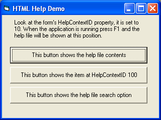



## Using chm \(compiled HTML\) help in your app

### Description

If you want to use .chm help in your application, these functions may help. The three included here call help by contextid, open the search option, or show the table of contents. Paste these into a module and either set your applications help file to a valid .chm file or change the references in the functions to point wherever you want. Comments and suggestions welcomed.
 
### More Info
 

             |
---                |---
**Submitted On**   |2004-01-23 12:20:34
**By**             |[Carl](https://github.com/Planet-Source-Code/PSCIndex/blob/master/ByAuthor/carl.md)
**Level**          |Intermediate
**User Rating**    |4.5 (18 globes from 4 users)
**Compatibility**  |VB 5\.0, VB 6\.0
**Category**       |[Miscellaneous](https://github.com/Planet-Source-Code/PSCIndex/blob/master/ByCategory/miscellaneous__1-1.md)
**World**          |[Visual Basic](https://github.com/Planet-Source-Code/PSCIndex/blob/master/ByWorld/visual-basic.md)
**Archive File**   |[Using\_chm\_1698531232004\.zip](https://github.com/Planet-Source-Code/carl-using-chm-compiled-html-help-in-your-app__1-51187/archive/master.zip)

